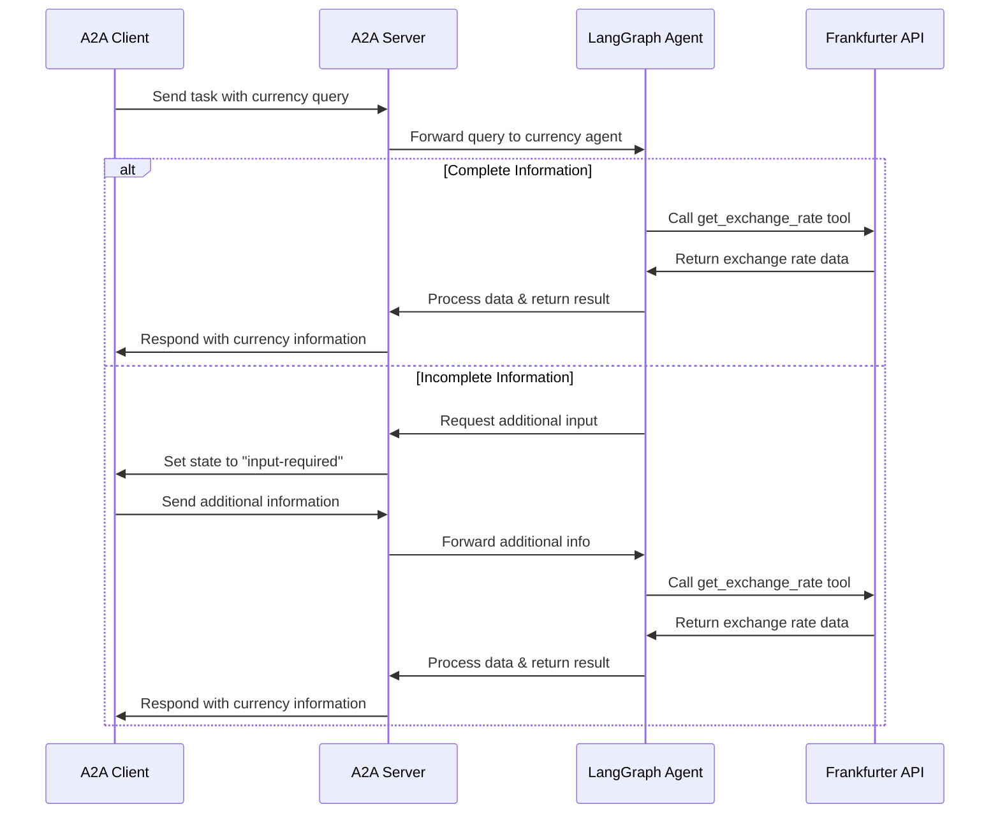

# Agent2Agent (A2A) Protocol Demo with LangGraph

This repository contains code samples and demos which use the [Agent2Agent (A2A) Protocol](https://goo.gle/a2a), featuring a LangGraph-based currency conversion agent and supporting tools.

## 🚀 Quickstart

```bash
# Install dependencies
uv sync

# Run the LangGraph currency agent
uv run python -m agents.app

# In another terminal, test the agent
cd agents && uv run app/test_client.py
```

## 📁 Project Structure

```
build-a2a-demo-langgraph/
├── agents/           # LangGraph currency conversion agent
├── a2a-inspector/    # Web-based tool for debugging A2A communications
├── demo/            # Demo web application with multi-agent orchestration
├── common/          # Shared utilities and types
├── hosts/           # Host agent implementations
│   ├── cli/         # Command-line A2A client
│   └── multiagent/  # Google ADK-based orchestrator agent
├── pyproject.toml   # Main project configuration
└── quickstart       # Quick setup guide
```

## 🔧 Components

### 1. LangGraph Currency Agent (`/agents`)

A currency conversion agent built with [LangGraph](https://langchain-ai.github.io/langgraph/) and exposed through the A2A protocol. It demonstrates conversational interactions with support for multi-turn dialogue and streaming responses.

**Key Features:**
- **ReAct Agent Pattern**: Uses LangGraph for reasoning and tool usage
- **Multi-turn Conversations**: Can request additional information when needed
- **Real-time Streaming**: Provides status updates during processing
- **Push Notifications**: Webhook-based updates with JWK authentication
- **Currency Exchange Tool**: Integrates with Frankfurter API for real-time rates

**Setup:**
```bash
cd agents

# Create environment file
echo "GOOGLE_API_KEY=your_api_key_here" > .env
# OR for OpenAI/compatible APIs:
echo "API_KEY=your_api_key_here" > .env
echo "TOOL_LLM_URL=your_llm_url" > .env
echo "TOOL_LLM_NAME=your_llm_name" > .env

# Run the agent
uv run app  # Default: localhost:10000
uv run app --host 0.0.0.0 --port 8080  # Custom host/port
```

**Container Build:**
```bash
podman build . -t langgraph-a2a-server
podman run -p 10000:10000 -e GOOGLE_API_KEY=your_key langgraph-a2a-server
```

### 2. A2A Inspector (`/a2a-inspector`)

A web-based tool designed to help developers inspect, debug, and validate servers that implement the A2A protocol. Built with FastAPI backend and TypeScript frontend.

**Features:**
- Connect to any A2A agent server
- View and validate Agent Cards
- Live chat interface
- Debug console showing raw JSON-RPC messages
- Spec compliance checks

**Setup:**
```bash
cd a2a-inspector

# Install dependencies
uv sync
cd frontend && npm install && cd ..

# Run frontend (terminal 1)
cd frontend && npm run build -- --watch

# Run backend (terminal 2)
cd backend && uv run app.py
```

Access at: http://127.0.0.1:5001

**Docker Setup:**
```bash
docker build -t a2a-inspector .
docker run -d -p 8080:8080 a2a-inspector
```

Access at: http://127.0.0.1:8080

### 3. Demo Web Application (`/demo`)

A [mesop](https://github.com/mesop-dev/mesop)-based web application showcasing multi-agent orchestration over A2A.

**Architecture:**
- **Frontend**: Mesop web app rendering conversations, forms, and images
- **Host Agent**: Google ADK agent orchestrating requests to remote agents
- **Remote Agents**: A2A clients connecting to various A2A servers

**Features:**
- Dynamically add agents via their AgentCard URLs
- Multi-agent conversations
- Complex content rendering (images, web forms)
- Task and message history visualization

**Setup:**
```bash
cd demo/ui

# Option A: Google AI Studio
echo "GOOGLE_API_KEY=your_api_key_here" >> .env

# Option B: Vertex AI
echo "GOOGLE_GENAI_USE_VERTEXAI=TRUE" >> .env
echo "GOOGLE_CLOUD_PROJECT=your_project_id" >> .env
echo "GOOGLE_CLOUD_LOCATION=your_location" >> .env

# Run the demo
uv run main.py
```

Access at: http://0.0.0.0:12000

**Container Build:**
```bash
cd demo
podman build -f ui/Containerfile . -t a2a-ui
podman run -p 12000:12000 --network host a2a-ui
```

### 4. Host Implementations (`/hosts`)

#### CLI Host (`/hosts/cli`)
A command-line client demonstrating A2A client capabilities.

```bash
cd hosts/cli
uv run . --agent http://localhost:10000
```

#### Multi-Agent Host (`/hosts/multiagent`)
Google ADK-based host agent that can communicate with multiple agents over A2A. Used by the demo web application.

## 🔄 How It Works

The LangGraph Currency Agent demonstrates the A2A protocol flow:



## 📋 Prerequisites

- Python 3.12 or higher
- [UV](https://docs.astral.sh/uv/) package manager
- Node.js and npm (for a2a-inspector frontend)
- Access to an LLM API (Google Gemini, OpenAI, or compatible)
- Docker/Podman (optional, for containerized deployment)

## 🔗 API Endpoints

- **LangGraph Currency Agent**: http://localhost:10000
  - Agent Card: http://localhost:10000/.well-known/agent.json
- **A2A Inspector**: http://127.0.0.1:5001
- **Demo Web UI**: http://0.0.0.0:12000

## 📚 Example Usage

### Synchronous Request
```json
POST http://localhost:10000
Content-Type: application/json

{
    "id": "12113c25-b752-473f-977e-c9ad33cf4f56",
    "jsonrpc": "2.0",
    "method": "message/send",
    "params": {
        "message": {
            "kind": "message",
            "messageId": "120ec73f93024993becf954d03a672bc",
            "parts": [
                {
                    "kind": "text",
                    "text": "how much is 10 USD in INR?"
                }
            ],
            "role": "user"
        }
    }
}
```

### Streaming Request
```json
{
    "id": "6d12d159-ec67-46e6-8d43-18480ce7f6ca",
    "jsonrpc": "2.0",
    "method": "message/stream",
    "params": {
        "message": {
            "kind": "message",
            "messageId": "2f9538ef0984471aa0d5179ce3c67a28",
            "parts": [
                {
                    "kind": "text",
                    "text": "how much is 10 USD in INR?"
                }
            ],
            "role": "user"
        }
    }
}
```

## 🔗 Related Repositories

- [A2A](https://github.com/a2aproject/A2A) - A2A Specification and documentation
- [a2a-python](https://github.com/a2aproject/a2a-python) - A2A Python SDK
- [a2a-inspector](https://github.com/a2aproject/a2a-inspector) - UI tool for inspecting A2A enabled agents

## 🤝 Contributing

Contributions welcome! See the [Contributing Guide](CONTRIBUTING.md).

## ❓ Getting Help

Please use the [issues page](https://github.com/a2aproject/a2a-samples/issues) to provide suggestions, feedback or submit a bug report.

## ⚠️ Security Disclaimer

**Important**: The sample code provided is for demonstration purposes and illustrates the mechanics of the Agent-to-Agent (A2A) protocol. When building production applications, it is critical to treat any agent operating outside of your direct control as a potentially untrusted entity.

All data received from an external agent—including but not limited to its AgentCard, messages, artifacts, and task statuses—should be handled as untrusted input. For example, a malicious agent could provide an AgentCard containing crafted data in its fields (e.g., description, name, skills.description). If this data is used without sanitization to construct prompts for a Large Language Model (LLM), it could expose your application to prompt injection attacks. Failure to properly validate and sanitize this data before use can introduce security vulnerabilities into your application.

Developers are responsible for implementing appropriate security measures, such as input validation and secure handling of credentials to protect their systems and users.

## 📄 License

This repository itself is not an officially supported Google product. The code in this repository is for demonstrative purposes only.

## 📖 Learn More

- [A2A Protocol Documentation](https://a2aproject.github.io/A2A/)
- [LangGraph Documentation](https://langchain-ai.github.io/langgraph/)
- [Frankfurter API](https://www.frankfurter.app/docs/)
- [Google Gemini API](https://ai.google.dev/gemini-api)
- [ADK Documentation](https://google.github.io/adk-docs/get-started/quickstart/)